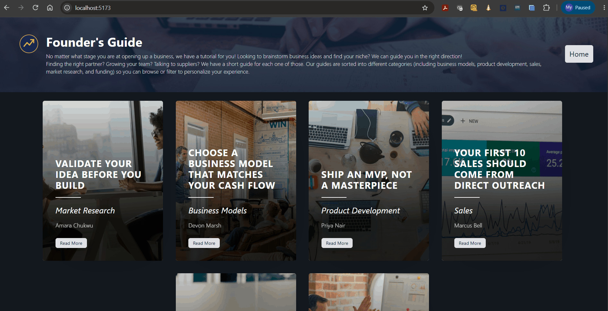

# WEB103 Project 1 - *Listicle*

Submitted by: **My Pham**

About this web app: **No matter what stage you are at opening up a business, we have a tutorial for you! Looking to brainstorm business ideas and find your niche? We can guide you in the right direction! Finding the right partner? Growing your team? Talking to suppliers? We have a short guide for each one of those. Our guides are sorted into different categories (including business models, product development, sales, market research, and funding) so you can browse or filter to personalize your experience.**

Time spent: **3** hours

## Required Features

The following **required** functionality is completed:

<!-- Make sure to check off completed functionality below -->
- [x] **The web app uses only HTML, CSS, and JavaScript without a frontend framework**
- [x] **The web app displays a title**
- [x] **The web app displays at least five unique list items, each with at least three displayed attributes (such as title, text, and image)**
- [x] **The user can click on each item in the list to see a detailed view of it, including all database fields**
  - [x] **Each detail view should be a unique endpoint, such as as `localhost:3000/bosses/crystalguardian` and `localhost:3000/mantislords`**
  - [x] *Note: When showing this feature in the video walkthrough, please show the unique URL for each detailed view. We will not be able to give points if we cannot see the implementation* 
- [x] **The web app serves an appropriate 404 page when no matching route is defined**
- [x] **The web app is styled using Picocss**

The following **optional** features are implemented:

- [x] The web app displays items in a unique format, such as cards rather than lists or animated list items

The following **additional** features are implemented:

- [x] Each tip card is a full-bleed image card with a dark gradient overlay so the title/category/submitter stay readable
- [x] Custom navy-and-gold professional color theme, with buttons that change color on hover
- [x] A custom-designed SVG logo and a full-width banner image in the site header
- [x] Detail page shows the full (uncropped) image alongside the tip text in a responsive two-column layout
- [x] A real Express catch-all 404 handler (not just a static file) returns an actual 404 status code

## Video Walkthrough

**Note: please be sure to record a walkthrough that shows every required feature above, including navigating to a unique detail-view URL for at least two different tips and hitting an undefined route to show the 404 page.**

Here's a walkthrough of implemented required features:

<!-- Replace this with whatever GIF tool you used! -->
GIF created with ...  Add GIF tool here
<!-- Recommended tools:
[Kap](https://getkap.co/) for macOS
[ScreenToGif](https://www.screentogif.com/) for Windows
[peek](https://github.com/phw/peek) for Linux. -->

## Notes

Describe any challenges encountered while building the app or any additional context you'd like to add.

## License

Copyright 2026 My Pham

Licensed under the Apache License, Version 2.0 (the "License"); you may not use this file except in compliance with the License. You may obtain a copy of the License at

> http://www.apache.org/licenses/LICENSE-2.0

Unless required by applicable law or agreed to in writing, software distributed under the License is distributed on an "AS IS" BASIS, WITHOUT WARRANTIES OR CONDITIONS OF ANY KIND, either express or implied. See the License for the specific language governing permissions and limitations under the License.